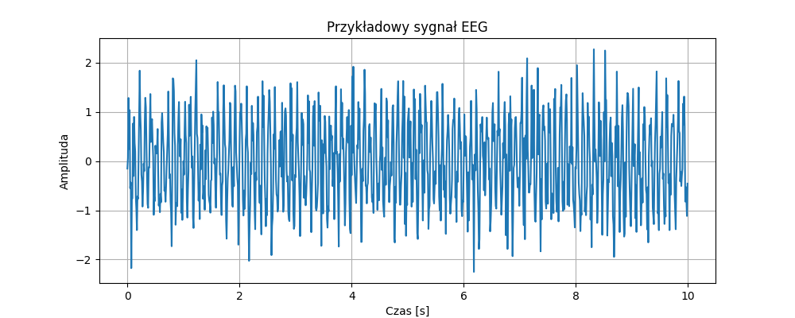

# EEG-BCI-from-zero

Projekt edukacyjny pokazujący podstawy pracy z danymi EEG.
Celem jest stworzenie prostego programu, który może rozpoznawać czynności na podstawie sygnałów EEG, np. podniesienie prawej ręki.

---

## Struktura projektu

```
EEG-BCI-from-zero/
├── assets/          # folder na wykresy EEG i pliki graficzne
├── src/
│   └── cli.py       # przykładowy skrypt generujący wykresy EEG
├── requirements.txt # lista bibliotek Python
└── README.md
```

---

## Instalacja

1. Sklonuj repozytorium:

```
git clone https://github.com/TWOJ_LOGIN/EEG-BCI-from-zero.git
cd EEG-BCI-from-zero
```

2. Utwórz i aktywuj wirtualne środowisko:

```
python -m venv venv
# Windows
venv\Scripts\activate
# macOS / Linux
source venv/bin/activate
```

3. Zainstaluj zależności:

```
pip install -r requirements.txt
```

---

## Uruchomienie przykładowego skryptu

Skrypt `src/cli.py` generuje przykładowy wykres EEG i zapisuje go do folderu `assets/`.

```
python src/cli.py
```

Po uruchomieniu w folderze `assets/` pojawi się plik `eeg_raw.png`.
Obrazek można użyć w README lub do dalszej analizy.

---

## Przykładowe użycie w README

```

```

---

## Biblioteki

* numpy
* matplotlib
* mne
* scikit-learn (opcjonalnie do dalszych eksperymentów)

---

## Cel projektu

* Nauka obsługi danych EEG w Pythonie.
* Tworzenie prostych wizualizacji sygnałów.
* Budowanie portfolio projektów do GitHub.
